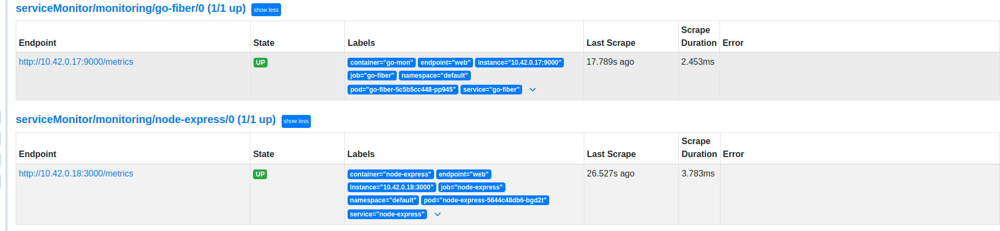
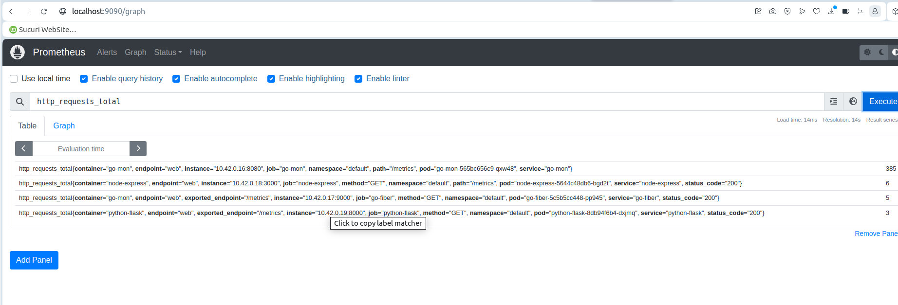
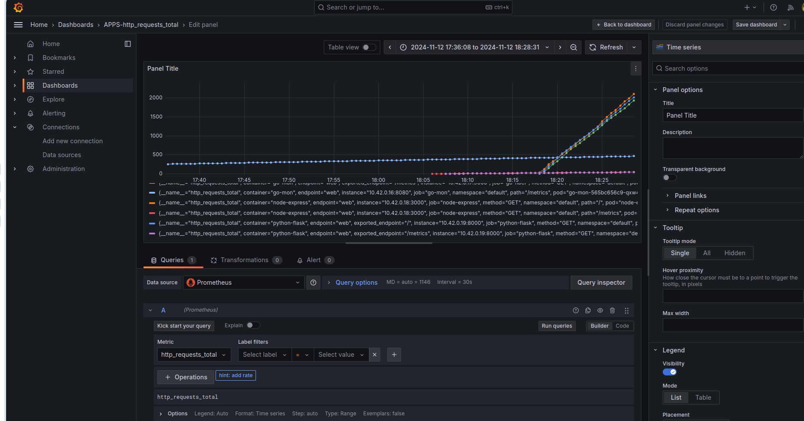

### Docker Compose

```
docker compose up -d
```


### k8s 

#### Create k8s cluster (k3d)
```
k3d cluster create sre
```
#### Install Prometheus Operator
```
cd k8s-manigest
kubectl create namespace monitoring
helm repo add prometheus-community https://prometheus-community.github.io/helm-charts
helm install prometheus-operator prometheus-community/kube-prometheus-stack --values prometheus.yaml -n monitoring

Note: serviceMonitorSelectorNilUsesHelmValues to false. So prometheus resource got updated and picked up serviceMonitors from other namespaces.

prometheus.yaml
===============
  serviceAccountName: monitoring-prometheus-oper-prometheus
  serviceMonitorNamespaceSelector: {}
  serviceMonitorSelector: {}
  version: v2.7.1

kubectl --namespace monitoring get pods

kubectl port-forward svc/prometheus-operator-kube-p-prometheus -n monitoring 9090:9090
kubectl port-forward svc/prometheus-operator-grafana -n monitoring 3000:80
kubectl get secret -n monitoring  prometheus-operator-grafana -o jsonpath="{.data.admin-password}" | base64 --decode ; echo
prom-operator
````
## Build & Push docker image
```
in services apps directories

docker build -t davarski/go-fiber:latest .
docker push davarski/go-fiber:latest
docker build -t davarski/node-express:latest .
docker push davarski/node-express:latest
docker build -t davarski/python-flask:latest .
docker push davarski/python-flask:latest
docker build -t davarski/traffic-generator:latest .
docker push davarski/traffic-generator:latest
```
### Deploy app and apply Prometheus Service Monitors
```
cd k8s-manifests
kubectl apply -f deployment-go.yaml -f service-go.yaml 
kubectl apply -f servicemonitor.yaml -n monitoring

kubectl apply -f deployment-node.yaml -f service-node.yaml 
kubectl apply -f servicemonitor-node.yaml -n monitoring

kubectl apply -f deployment-python.yaml -f service-python.yaml 
kubectl apply -f servicemonitor-python.yaml -n monitoring

kubectl apply -f deployment-traffic-generator.yaml

kubectl get servicemonitors -n monitoring

kubectl logs traffic-generator-88f974f48-lfjgw
Traffic generator started for services: ['http://node-express:3000', 'http://python-flask:8000', 'http://go-fiber:9000']
Request to http://python-flask:8000: Status 200
Request to http://node-express:3000: Status 200
Request to http://node-express:3000: Status 200
Request to http://node-express:3000: Status 200
Request to http://python-flask:8000: Status 200
Request to http://go-fiber:9000: Status 200
Request to http://go-fiber:9000: Status 200


```




Create new Grafana dashboard:



